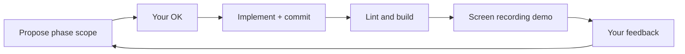

# Hometown Serenity — Step-by-step build with demos

## Primary design authority: Master Visual Specification Plan V2

**Aesthetic name:** Sage & Obsidian Alchemy

V2 text is **incorporated below**. It **supersedes** mockup screenshots where they conflict (fonts, colors, home pillar labels, About layout). Mockups still help for visual density (glass card styling, footer, nav chrome).

**Still missing** (not blocking maintenance page or Phase 1):

- Substack + YouTube URLs (not on current live pages)
- Premium audio checkout URLs
- High-res portrait **file** for production (identified below; chat/Canva preview is reference only)
- Logo: **concept generated** (see Logo design section) — SVG refinement in Phase 1
- Confirm **Netlify form** vs **Resend** (see below)

**Resolved from live sites** (see next section): Calendar, Jotform, Drive PDF, social, Canva copy, phone/email.

Save canonical copy in `docs/hometown-v2-spec/V2.md` during Phase 0.

---

### Live site sources (your two pages — fetched from production)

Could not read browser tabs on the VM; content pulled from **public URLs** that match your link hub + Canva “Visit Our Website” target.

| Page | URL | Role today |
|------|-----|------------|
| **Link hub** | [https://hometownserenity.com](https://hometownserenity.com) | Interim landing / link-in-bio while full site is built |
| **Canva site** | [https://hometownserenity.my.canva.site/ashmarie423](https://hometownserenity.my.canva.site/ashmarie423) | Fuller marketing copy (“Visit Our Website” target) |

**Do not use** [ashleyromero.co](https://www.ashleyromero.co) — different Ashley Romero (NC coaching); unrelated.

#### Link hub structure (→ maintenance page layout)

- **Header:** Clinical Hypnotherapy & Healing · Hometown Serenity · Ashley Romero, CMH · CAHA
- **Footer line:** “Where the nervous system finds its way home.”
- **Begin Your Journey:** Book Free Discovery Call · Schedule 1:1 Session · Serenity Sanctuary App
- **Explore:** Visit Our Website (Canva — eventually this Next.js app)
- **Free Resources:** Sample Dream Journal · Handwriting Analysis — Free Mini Reading
- **Connect:** (870) 750-1275 · ashleyromero@hometownserenity.com
- **Follow Along:** Instagram · Facebook · Indeed

#### Canva copy (→ maintenance hero / about snippets + future About page)

- Tagline: “Allow self-discovery to flow through you and illuminate your soul’s purpose”
- Themes: identity beyond roles, not “fixing” but “being found”, integrative path (NLP, hypnotherapy, sound frequency, somatic/breathwork, holistic nutrition)
- Bio angle: Ashley Romero, CMH, CAHA — clinical hypnotherapy & behavioral coaching; “fellow traveler”
- CTA: “Book A Discovery Call” / “Your Rhythm is Waiting”
- Credentials note: AOS Mind Body Psychology (graduating June 2027), ISSA Yoga 200

#### `EXTERNAL_LINKS` (extracted — wire in Phase 0c)

```ts
export const EXTERNAL_LINKS = {
  discoveryCall: "https://calendar.app.google/cRjyQ2t3FXPMPLSC7",
  integrationSession: "https://calendar.app.google/cRjyQ2t3FXPMPLSC7", // same link today — confirm if 1:1 should differ
  serenityApp: "https://www.jotform.com/app/261251095682155",
  canvaSite: "https://hometownserenity.my.canva.site/ashmarie423",
  dreamJournalSample: "https://drive.google.com/file/d/1ioXAcCwEHSMNmDIrIL15oXs-9syZVdUf/view?usp=drivesdk",
  handwritingJotform: "https://form.jotform.com/261354618025050",
  phone: "tel:8707501275",
  email: "mailto:ashleyromero@hometownserenity.com",
  instagram: "https://www.instagram.com/hometownserenity?igsh=emI5aG9ubnY4M3U3&utm_source=qr",
  facebook: "https://www.facebook.com/profile.php?id=61583873646491",
  indeed: "https://profile.indeed.com/p/ashleyr-y56g66d",
} as const;
```

#### Ashley headshot (user-confirmed — Canva element + chat reference)

**Source:** Canva site section `#PBXcf6mmy5nnYyBB` (browser-selected `div.Izwocg`, ~226×338px display). Matches V2 About texture: professional portrait blended with misty mountains.

**Visual (confirmed):** Chest-up photo — dark blazer, white V-neck, thin gold necklace, long dark wavy hair, neutral studio background, approachable smile.

**Production asset (Phase 0b):**

| Priority | Action |
|----------|--------|
| 1 (best) | You export/upload original JPG/PNG from Canva or photographer → `public/images/about/ashley-romero-headshot.webp` |
| 2 | You drag file into repo / Google Drive link with download permission |
| 3 (fallback only) | Agent saves chat reference image — **not** ideal for full-width Phantom Blend |

**Canva scrape note:** Public `_assets/images/*.png` on the published site are low-res thumbs (180–400px) or icons — **not** suitable for About page. Full-res lives in Canva editor export.

**Implementation (Demo 7 — About):**

- `next/image` with alt: “Ashley Romero, CMH, clinical hypnotherapy practitioner”
- **No** Canva lavender frame or blue selection border — V2 Obsidian/Sage treatment only
- Phantom Blend: portrait layer + `backgrounds/about-mountains.webp` (misty forest image from chat textures can double as mountains)
- V2 **two-column** layout: Guide (left: heading + bio + optional portrait inline) | Connection (right: frosted form)
- Mockup three-column portrait-right is **deprecated** in favor of V2 + this asset placement

#### Ashley bio (user-confirmed — Canva element + full Canva page text)

**Source:** Same Canva section `#PBXcf6mmy5nnYyBB`; bio block `#LBJWCyF01t483Cym` (paragraph below headshot). Canva styling: black serif on lavender — **not** shipped; V2 uses **Parchment** on **Obsidian**, **Outfit/Inter**.

**Primary bio paragraph** (user-selected — goes in `hometown.ts` → About “The Guide”):

> I’m Ashley Romero, a practitioner of clinical hypnotherapy and behavioral coaching. My work at Hometown Serenity is rooted in the belief that everyone possesses a vibrant, iridescent soul purpose that simply needs the right environment to illuminate. I am not here to fix you; I am here to help you peel back the layers and reconstruct an identity that feels authentically yours.

**Supporting About copy** (same Canva section / page — optional blocks for Demo 7):

| Block | Text (summary) | Use on About |
|-------|----------------|--------------|
| Eyebrow | “A Fellow Traveler on the Path to Self-Discovery.” | `about.eyebrow` |
| Pull quote | “I know what it feels like to navigate the world through the lens of your titles…” | `about.pullQuote` |
| Closing line | “Allow the veil to lift. The light was always there.” | `about.closingLine` |
| Credentials | CMH, CAHA · AOS Mind Body Psychology (graduating June 2027) · ISSA Yoga 200 | `about.credentials` |
| Heading | “I am Ashley Romero.” (V2) + bio above | `about.title` + `about.bio` |

**Canva long-form NOT on About** (reserve for other routes during Demos 4–6):

- “Beyond the roles of parent, spouse…” → Services hero / philosophy
- “You are more than the titles you hold” + layered identity → Services or Inked intro
- “An Integrative Path to Your Center” + five modalities (NLP, hypnotherapy, sound, somatic, nutrition) → **Services** page feature list
- “Who are you when no one is in the room?” → Services or Inked
- “Your Rhythm is Waiting” → Services CTA footer

**Email normalization:** Use `ashleyromero@hometownserenity.com` (link hub); Canva shows mixed-case `AshleyRomero@HometownSerenity.com`.

**Phase 0c:** Add `about` object to `hometown.ts` with fields above; no lorem placeholders for confirmed copy.

#### Accreditation seals (user-confirmed — Canva section `#PBPVgVTngnXLxkdN`)

All three seals sit in the same Canva credentials block (`#PBPVgVTngnXLxkdN`); displayed **side-by-side** (flex-wrap on mobile) on maintenance page and About. Matches [hometownserenity.com](https://hometownserenity.com/) trust positioning while full site is built.

| Seal | Canva element | Asset path | Alt text |
|------|---------------|------------|----------|
| **American Hypnosis Association (AHA)** | `#LB1H3JLQfSvDQ5Q3` (~114px) | `badges/aha-seal.webp` | American Hypnosis Association member seal |
| **Hypnosis Motivation Institute (HMI)** — “58 Years of Excellence” | `#LBF8FW9Lz9zWKlSf` (~117px) | `badges/hmi-58-years-seal.webp` | Hypnosis Motivation Institute — 58 years of excellence |
| **ISSA Certified** (International Sports Sciences Association) | `#LBls8wWhwPCqcVvz` (~159×163px) | `badges/issa-certified-seal.webp` | ISSA certified — International Sports Sciences Association |

**HMI seal detail:** Circular badge, serrated silver border, navy ring text “HYPNOSIS MOTIVATION INSTITUTE” / “YEARS OF EXCELLENCE”, center **58**.

**ISSA seal detail (user-confirmed `#LBls8wWhwPCqcVvz`, ~159×163px):** Circular badge, lavender/periwinkle monochromatic palette on Canva (export hi-res; site displays on obsidian/glass only — no purple gradient backdrop). Outer ring “INTERNATIONAL SPORTS SCIENCES ASSOCIATION”, center italic **ISSA** wordmark with motion swoosh, “Since 1988”, bottom **CERTIFIED**. Pairs with bio credential **ISSA Yoga 200** and complements AHA/HMI hypnotherapy seals.

**Acquisition (Phase 0b):** Export all three seals from Canva or upload PNGs (preferred 2×; ISSA is largest ~320px wide at 2×). Published Canva scrape does not expose hi-res badge URLs.

**`hometown.ts` shape:**

```ts
credentials: {
  title: "Ashley Romero, CMH · CAHA",
  seals: [
    { id: "aha", src: "/images/badges/aha-seal.webp", alt: "..." },
    { id: "hmi", src: "/images/badges/hmi-58-years-seal.webp", alt: "..." },
    { id: "issa", src: "/images/badges/issa-certified-seal.webp", alt: "..." },
  ],
}
```

**Placement:**

| Page | Where |
|------|--------|
| **Maintenance / bridge (Phase 0d)** | Credentials row: **AHA + HMI + ISSA seals** (wrap on mobile), then “Ashley Romero, CMH · CAHA” |
| **About (Demo 7)** | Same row under bio |
| **Footer (optional)** | Scaled-down trio if space allows |

**Component:** `AccreditationBadges` — `flex` row, gap `1rem`, `next/image` with fixed height (~56–72px desktop, touch-friendly spacing).

**Design:** Seals keep **full color** (no Phantom Blend desaturation). No Canva lavender/pink gradient behind them — obsidian or glass panel only.

**Optional later:** Additional CMH/CAHA-specific badges if distinct from AHA/HMI — add to `seals[]` array.

#### Logo — Hometown Serenity (proposed concept for Ashley)

**Status:** No client logo existed; agent generated **mark concept** aligned with V2 Sage & Obsidian Alchemy for review.

**Design rationale (why Ashley may like it):**

- **Mountains + mist** — matches V2 About texture (grounded guide, misty mountains) and Services forest grounding
- **Sage + teal + gold** — exact V2 palette; gold star/light = “illuminate soul purpose” (Canva copy)
- **Circular emblem** — consistent with AHA/HMI accreditation seals and mockup header marks; works as favicon
- **Calm, not clinical-cold** — soft curves vs. sharp corporate; fits hypnotherapy + nervous system healing
- **Not religious/esoteric busy** — single horizon, one wave, one light point; professional for CMH · CAHA

**Generated preview:** `hometown-serenity-logo-mark.png` (artifact — show Ashley for feedback)

**Phase 1 deliverables (after approval):**

| Asset | Path | Use |
|-------|------|-----|
| Mark (SVG) | `public/images/logo/mark.svg` | Header icon, favicon source |
| Mark (PNG 512) | `public/images/logo/mark-512.png` | OG fallback, social |
| Wordmark lockup | `public/images/logo/logo-lockup.svg` | Header: mark + “Hometown Serenity” in **Outfit** |
| Favicon | `public/favicon.ico` + `app/icon.png` | Next.js metadata |

**Wordmark text:** “Hometown Serenity” — Outfit SemiBold, parchment on obsidian header; optional subtitle “Ashley Romero, CMH” in Inter small caps for maintenance only.

**If Ashley wants changes:** common tweaks — more leaf/pine, lotus like early mockup, drop star, horizontal wordmark only, lighter sage. Iterate one round before SVG build.

**Do not** use Canva Cinzel/Cormorant or link-hub gold `#c9a84c` — stay on V2 tokens.

#### Background textures (user-provided in chat — save to `public/images/backgrounds/` in Phase 0b)

| Asset | V2 route | Source |
|-------|----------|--------|
| Celestial map / gold network | `/`, `/resources` | User image (abstract star chart) |
| Dark water ripples | `/audio-library` | User image |
| Misty pine forest (B&W) | `/services` | User image |
| Blurred bookshelf | `/inked-integration` | User image |

Portrait **identified** (see Ashley headshot section); need **upload/export** for hi-res file.

---

### Global design system (from V2)

#### Color palette

| Token | Hex | Role |
|-------|-----|------|
| `obsidian` | `#181C1F` | Primary background base |
| `sage` | `#8BA892` | Primary accent (grounding green) |
| `ethereal-teal` | `#5B7B7F` | Secondary accent |
| `alchemy-gold` | `#D4C193` | Premium highlight, gold CTAs |
| `parchment` | `#F7F7F2` | Primary text |

Map in [`globals.css`](src/app/globals.css) `@theme` and [`DESIGN_TOKENS.md`](DESIGN_TOKENS.md). Verify WCAG AA: parchment on obsidian (~15:1 — good); sage/gold buttons need dark text (`obsidian` on gold/sage).

#### Typography

| Role | Font | Load via `next/font` |
|------|------|----------------------|
| Headers | **Outfit** | `--font-display` |
| Body | **Inter** | `--font-sans` |

Replaces prior plan (Cormorant/Playfair + Geist). Remove Geist from layout when executing.

#### Phantom Blend (per-page backgrounds)

Every route gets a **thematic texture** via shared `PhantomBlendBackground` component:

1. Full-bleed `next/image` or CSS `background-image` (per-page asset in `public/images/backgrounds/`).
2. Desaturate + color wash (Sage/Teal tint) via CSS `filter` / overlay gradients.
3. Fade into obsidian: stacked gradients so texture reads at **~10–15% effective opacity** at edges.
4. Sit **behind** frosted glass content; never compete with parchment text.

#### Interactive layers (stacking order)

```
[ Obsidian base ]
[ Phantom Blend texture — per route ]
[ R3F particle field — Sage + Teal pixels, persistent canvas ]
[ Frosted glass panels + parchment text — DOM content ]
```

- **Frosted glass:** `backdrop-filter: blur()`, semi-transparent obsidian/sage border, radius per mockups.
- **3D particles:** R3F ambient field (not per-page Canvas). Sage `#8BA892` + Teal `#5B7B7F` drifting pixels; static when `prefers-reduced-motion`.

---

### Site map (from V2 — six content pages)

| V2 # | Page | Route | Phantom texture theme |
|------|------|-------|---------------------|
| 1 | Home (The Entryway) | `/` | Night sky / sacred geometry / celestial map |
| 2 | Audio Library (The Flow) | `/audio-library` | Dark water ripples (macro) |
| 3 | Services & Booking (The Grounding) | `/services` | Misty pine forest silhouette |
| 4 | Inked Integration (The Knowledge) | `/inked-integration` | Dark library bookshelves / scrolls |
| 5 | Resources & Tools (The Exploration) | `/resources` | Celestial map / constellations |
| 6 | About Ashley & Contact (The Guide) | `/about` | Ashley portrait + misty mountains |

**Nav (derive from V2 + mockups):** Home · About · Services · Audio Library · Inked Integration · Resources · Contact?

- V2 places **contact only on About** (right column: email/phone + form).
- Mockup nav includes separate **Contact** — **Decision:** `/contact` redirects to `/about#connect` OR duplicate slim form page for nav link (Demo 8). Default: **About holds form**; Contact nav → `/about#connect`.

**Home pillars (V2 correction):** Three glass cards link to **Services**, **Audio Library**, **Inked Integration** — not “Work With Me” on home (that’s the Services hero).

---

### Page specs (V2 layout + content)

#### Page 1 — Home

- **Hero:** “Welcome to Hometown Serenity. Nervous System Healing, Mind-Body Alchemy, and Self-Discovery.”
- **Pillars:** Three frosted glass cards → `/services`, `/audio-library`, `/inked-integration`.
- **Texture:** Celestial / sacred geometry (subconscious potential).
- **Inspiration label:** Abstract Celestial Map (source image TBD).

#### Page 2 — Audio Library

- **Left — Open Sanctuary (free):** e.g. “Grounding the Nervous System”; **Sage** “Play/Download” buttons.
- **Right — Deep Dive (premium):** e.g. “Subconscious Dream Walk”; **Alchemy Gold** “Purchase Audio” → checkout URL.
- **Texture:** Dark water ripples (soundwaves / nervous system fluidity).

#### Page 3 — Services & Booking

- **Hero:** “Work With Me. Step into a container of intentional healing…” (full copy in `hometown.ts`).
- **Three frosted cards:** Discovery Call (Gold CTA), 1:1 Integration Session (**featured**, Gold CTA), Handwriting Analysis (**Sage** CTA).
- **Texture:** Misty pine forest (somatic / nature grounding).

#### Page 4 — Inked Integration

- **The Written Word:** Row of **three** frosted essay cards (Substack) + **email opt-in widget** below.
- **The Spoken Word:** **Two columns** — YouTube embed **left**; channel description + Subscribe **right** (mockup had video left; align to V2).
- **Texture:** Dark aesthetic library / scrolls.

#### Page 5 — Resources & Tools

- **Dream Journal:** **Gold-glow** card, journal mockup, button → **Google Drive PDF** download.
- **Serenity Sanctuary App:** **Sage-glow** card, phone mockup, button → **Jotform app** URL.
- **Texture:** Celestial map / constellations (navigation / personal narrative).

#### Page 6 — About Ashley & Contact

- **Two columns** (V2 — not three-column mockup):
  - **Left — The Guide:** “I am Ashley Romero.” Bio + philosophy.
  - **Right — The Connection:** Frosted panel with email/phone + **contact form**.
- **Texture:** Portrait blended with misty mountains.
- **Form:** V2 says **“clean Netlify contact form”** — see decision below.

---

### Contact form decision (V2 vs repo)

| Option | Pros | Cons |
|--------|------|------|
| **A — Netlify embed** | Matches V2 verbatim | Extra vendor if site is on Vercel; need Netlify form name/URL |
| **B — Keep Resend API** | Already in repo; one stack on Vercel | Not “Netlify” but same UX |
| **C — Netlify Forms via API** | Possible with build plugin | More setup |

**Plan default until you say otherwise:** **B** — same frosted UI as V2; existing [`ContactForm`](src/components/contact/ContactForm.tsx) + [`api/contact`](src/app/api/contact/route.ts) with Resend. If you have a Netlify form URL, switch to **A** in Phase 3/8.

---

### Background image sourcing (Phase 0b)

V2 lists **inspiration names**, not download URLs. During Phase 0b:

| Route | Texture | Asset path (target) | Source strategy |
|-------|---------|---------------------|-----------------|
| `/` | Celestial / sacred geometry | `backgrounds/home-celestial.webp` | User URL **or** curated Unsplash/Pexels + Phantom Blend |
| `/audio-library` | Water ripples | `backgrounds/audio-ripples.webp` | Same |
| `/services` | Misty pine forest | `backgrounds/services-forest.webp` | Same |
| `/inked-integration` | Library shelves | `backgrounds/inked-library.webp` | Same |
| `/resources` | Celestial / constellations | `backgrounds/resources-celestial.webp` | May reuse home asset with different crop |
| `/about` | Portrait + mountains | `about/ashley-romero-headshot.webp` + `backgrounds/about-mountains.webp` | Portrait confirmed — **export hi-res** from Canva |

Document choices in `docs/hometown-v2-spec/ASSETS.md`. **Do not hotlink** inspiration sites in production.

---

### Phase 0 — V2 ingestion (updated)

**0a — Parsed** ✓ Global system + six pages (this plan section)

**0b — Images** (still required)

- Download user-provided URLs **or** license-safe placeholders per table above
- Ashley portrait: **export hi-res** from Canva (element confirmed; published site only has thumbnails)

**0c — Repo prep**

- `docs/hometown-v2-spec/V2.md` — paste full V2 text
- `hometown.ts`, types, `SITEMAP.md`, `EXTERNAL_LINKS` stubs
- Remove `/work` routes; branch `cursor/hometown-serenity-c3c3`

**Phase 0 gate:** Phantom Blend visible on stub routes; `ASSETS.md` complete; tokens in CSS match table above.

---

### Phase 0d — Maintenance / bridge page (NEW — before or with Phase 1)

**Why:** Full Next.js site is not live yet; [hometownserenity.com](https://hometownserenity.com) already serves a link hub. The new app needs an equivalent **bridge page** so Vercel deploys are useful immediately and visitors keep working CTAs during the phased build.

**Route strategy (pick at execute time — default B):**

| Option | Behavior |
|--------|----------|
| A | `/` = maintenance until Demo 8; then swap to real home |
| B | `/` = maintenance + `middleware` when `MAINTENANCE_MODE=true`; full site on preview URL |
| C | Ship maintenance as **only** page at root until launch; phased pages on preview |

**Default: B** — env flag toggles maintenance without deleting progress.

#### Maintenance page content (from link hub + Canva)

- **Design:** V2 Sage & Obsidian (Outfit/Inter, not link hub’s Cinzel/Cormorant) + Phantom Blend celestial texture + optional Sage/Teal particles (light)
- **Hero:** Hometown Serenity · Ashley Romero, CMH · CAHA
- **Credentials row:** **AHA + HMI + ISSA seals** (retina 2×, flex-wrap on mobile) + CMH · CAHA text — see Accreditation seals section
- **Sub:** “Allow self-discovery to flow through you and illuminate your soul’s purpose” (Canva) or link hub footer: “Where the nervous system finds its way home.”
- **Status line:** “Our full website is being refined. Everything you need is still here.” (plain, not corporate)
- **Link sections** (mirror link hub — all `EXTERNAL_LINKS` above):
  - Begin Your Journey (gold CTAs)
  - Free Resources (ghost + subtext from link hub)
  - Connect (phone + email)
  - Follow Along (Instagram, Facebook, Indeed)
- **Do not** link to Canva as “Visit Website” once Next.js preview is live — replace with “Coming soon” or hide Explore section
- **No** full Canva long-form on maintenance page — that copy lands on About/Services in Demos 4–7
- **Accessibility:** same keyboard/focus rules; reduced motion calms orbs/particles
- **SEO:** `noindex` on maintenance-only deploy optional; remove when full site launches

**Files (at execute):** `src/app/page.tsx` (maintenance variant) OR `src/app/(maintenance)/page.tsx`, `src/middleware.ts`, `src/components/maintenance/BridgeLinks.tsx`, `src/components/ui/AccreditationBadges.tsx`, reuse `GlassPanel` + `ButtonGold`/`ButtonSage`

**Optional demo:** Short recording showing every external link opens correctly.

**Launch path:** When Demo 8 completes → set `MAINTENANCE_MODE=false` → root becomes V2 Home; link hub DNS can point to Vercel or retire.

---

## Alignment with [`docs/00_MASTER_PROJECT.md`](docs/00_MASTER_PROJECT.md)

Your Downloads copy should match the repo’s [`docs/00_MASTER_PROJECT.md`](docs/00_MASTER_PROJECT.md). **Same engine, different destination** — we are still building the immersive marketing site the master doc describes, but the **site map and content model** changed from a generic portfolio to **Hometown Serenity** (your mockups).

### Still on track (master principles we keep)

| Master requirement | Status |
|--------------------|--------|
| Next.js App Router + TypeScript + Tailwind | Done in repo |
| One persistent R3F `<Canvas>` at shell level | Done ([`PersistentCanvas`](src/components/canvas/PersistentCanvas.tsx), [`RouteSceneSync`](src/components/providers/RouteSceneSync.tsx)) |
| Lenis smooth scroll | Done |
| GSAP installed (ScrollTrigger sequences) | Dependency present; **not wired yet** |
| react-hook-form + zod + contact email | Partial — Resend API exists; V2 says Netlify — default keep Resend unless you provide Netlify form |
| `prefers-reduced-motion`, skip link, focus states | Baseline in repo |
| Propose → OK → code working style | This phased demo plan |
| Deploy target Vercel | Planned in Phase 8 polish |
| Sanity CMS | **Deferred** — mock content first (master Phase 7; still valid later) |

### Intentional divergences (not mistakes — product changed)

| Master doc assumption | Hometown Serenity plan |
|-----------------------|------------------------|
| **Portfolio:** `/work`, `/work/[slug]` | **Practice site:** `/services`, `/audio-library`, `/inked-integration`, `/resources` |
| “Showcases your work” + project CMS | Services, audio tiers, essays, toolkit offerings |
| 3D-heavy early (Phases 4–6 before CMS) | Photo/glass UI first; **ambient canvas polish in Demo Phase 8** (master keystone already built) |
| Generic Studio Meridian scaffold | Rebrand to Hometown Serenity tokens and copy |
| 12 technical phases | **8 demo phases** — each maps to multiple master phases below |

### Where we are on the master phase ladder (today)

| Master phase | What it means | Repo today |
|--------------|---------------|------------|
| 0 Foundation | Tools + accounts | **Done** (Cloud agent environment) |
| 1 Scaffold | Next + deps + smoke 3D | **Done** |
| 2 UX / tokens | Design system + content types | **~40%** — `DESIGN_TOKENS.md` exists but CSS still Studio Meridian |
| 3 Shell | Nav + all routes | **~50%** — shell exists; wrong routes and branding |
| 4 Persistent canvas | Keystone architecture | **Done** |
| 5 Hero scene | Real scene pattern | **~20%** — placeholder torus knot, not route-themed scenes |
| 6 Animation | GSAP + ScrollTrigger | **Not started** |
| 7 CMS | Sanity | **Not started** (mock fallback only) |
| 8 Contact form | Validated + email | **~70%** — API works; needs Hometown UI + hardening |
| 9 Optimization | a11y + Lighthouse | **Not started** |
| 10 SEO | OG, sitemap, JSON-LD | **Not started** |
| 11 Deployment | Vercel + domain | **Not started** |
| 12 Handoff docs | MAINTENANCE.md etc. | **Not started** |

**Verdict:** On track for **architecture and stack**. **Behind** on master Phases 6–7, 9–12. **Ahead** on Phase 4 (canvas) and partially Phase 8 (contact API). **Product scope** shifted from portfolio to Hometown — that requires updating `SITEMAP.md` / content types when we execute (not a conflict with the master process).

### Mapping: demo phases → master phases

| Demo phase | Delivers for you | Covers master phases |
|------------|------------------|----------------------|
| 0 Prep | V2.md, assets, hometown.ts, remove `/work` | Master **2**–**3** cleanup |
| 1 Shell | V2 tokens, Phantom Blend, Outfit/Inter, nav | Master **2** + **3** |
| 2 Home | `/` Entryway | Master 3 |
| 3 Audio | `/audio-library` Flow | Master 3 |
| 4 Services | `/services` Grounding | Master 3 |
| 5 Inked | `/inked-integration` Knowledge | Master 3 |
| 6 Resources | `/resources` Exploration | Master 3 |
| 7 About | `/about` Guide + form | Master 3 + **8** |
| 8 Polish | Particles, SEO, Lighthouse, deploy prep | Master **5**–**6**, **9**–**11** |

Master **Phase 7 (Sanity)** and **Phase 12 (handoff)** remain a **follow-on** after Demo Phase 8 unless you want CMS before launch.

---

## Rethink: how we'll build this

The first plan tried to do too much in one pass. This version optimizes for **you watching the site come together**:

1. **One vertical slice per phase** — each phase ships something you can see in the browser, not hidden infrastructure.
2. **Demo at every checkpoint** — after each phase I run `pnpm dev`, walk the new UI in a **screen recording** (nav, responsive resize, key interactions), and save it as an artifact you can watch.
3. **Your OK gates the next phase** — per project rules, I propose the phase, you approve, I implement, I demo, you react, we continue.
4. **Placeholders first, swap later** — layout and typography match mockups early; your real images, copy, and URLs plug into a single content file without restructuring pages.
5. **3D comes last** — mockups are driven by photographic backgrounds and glass UI, not heavy 3D. The persistent R3F canvas stays mounted (architecture rule) but starts as a minimal static fallback; ambient particles land in the final polish phase so visuals aren't blocked on WebGL tuning.

---

## What I already have

| Source | Useful for |
|--------|------------|
| Your 6 mockup screenshots | Layout, hierarchy, nav order, color feel, component structure |
| Contact info from mockups | Phone `870-750-1275`, email `ashleyromero@hometownserenity.com` |
| Next.js scaffold | App Router, layout, contact API ([`src/app/api/contact/route.ts`](src/app/api/contact/route.ts)), Lenis scroll |
| Glass CSS patterns | [`src/app/globals.css`](src/app/globals.css) — extend, don't reinvent |
| Project architecture rules | One persistent canvas, a11y, `next/image`, metadata helpers |

## What I do **not** have yet (blocks polish, not first demos)

| Gap | Impact if missing |
|-----|-------------------|
| **Logo file** | Text + circle placeholder in header until you supply SVG/PNG |
| **Background images** | CSS gradients + subtle patterns until forest/particle assets arrive |
| **Ashley portrait** | Gray placeholder frame on About page |
| **Final written copy** | Placeholder bio/service text from mockups (with typos fixed) |
| **External URLs** | Buttons link to `#` or staging placeholders until real Calendar/Jotform/etc. |
| **Audio files** | Play buttons disabled or sample silence until files uploaded |
| **Dream Journal PDF** | Download button shows "coming soon" until file provided |
| **Substack embed** | Link cards work; live subscribe widget needs your Substack URL |
| **Premium audio pricing** | Show `$X.XX` placeholder until you set prices |
| **RESEND_API_KEY** | Form works in dev (logs to console); live email needs env var |

**Bottom line:** I can build and demo the full **structure and visual design** now. **Production-ready content and integrations** need your inputs below.

---

## What you can give me (priority order)

### Tier A — unlocks the best-looking demos early

Upload into the repo or share links; I'll place them under `public/images/`:

| Item | Format | Used on |
|------|--------|---------|
| Logo | SVG or PNG (transparent) | Header, favicon |
| Site backgrounds | JPG/WebP, ~1920px wide | Per-page hero layers (forest, particles, book, etc.) |
| Ashley headshot | Export from Canva → `about/ashley-romero-headshot.webp` | About page (confirmed asset) |
| AHA + HMI + ISSA seals | Export from Canva → `badges/aha-seal.webp`, `hmi-58-years-seal.webp`, `issa-certified-seal.webp` | Maintenance + About credentials row |
| Essay / card thumbnails | JPG/WebP | Inked Integration cards |
| Dream Journal cover art | JPG/WebP | Resources page |
| App mockup screenshot | PNG | Resources page |

If you have a **Figma file** or **folder of exports**, that's ideal—one drop replaces many individual files.

### Tier B — unlocks real buttons (not placeholders)

Paste URLs into a simple list or `.env.local`—I'll wire [`src/lib/constants.ts`](src/lib/constants.ts):

| Link | Example |
|------|---------|
| Google Calendar — Discovery Call | `https://calendar.google.com/...` |
| Google Calendar — 1:1 Integration Session | separate or same link? |
| Jotform — handwriting sample | `https://form.jotform.com/...` |
| Jotform / app — Serenity Sanctuary | mobile app URL |
| Indeed resume | Ashley's Indeed profile URL |
| Substack | publication URL |
| YouTube channel | channel URL + **one featured video ID** for embed |
| Facebook / Instagram | profile URLs |
| Dream Journal PDF | file upload or hosted URL |

### Tier C — unlocks accurate copy and commerce

| Item | Notes |
|------|-------|
| **Bio paragraph** | Final About text (mockup had a "trapped trapped" typo) |
| **Service descriptions** | Discovery call, 1:1 session, handwriting analysis |
| **Audio track list** | Title, description, free vs premium, price if premium |
| **Audio files** | MP3/WAV for each track, or hosted URLs |
| **Essay list** | Title, snippet, image, Substack post URL (3+ essays) |
| **Toolkit copy** | Dream Journal + app descriptions |
| **Arc of Integration** | Confirm labels: Listen & Align, Uncover & Decode, Integrate & Steady |

### Tier D — launch / ops (later phases)

- `RESEND_API_KEY` for live contact email
- Vercel project / custom domain `hometownserenity.com`
- Stripe or checkout URLs if premium audio sells on-site

---

## Demo workflow (what you'll watch each phase)



Each recording covers:

- Desktop walkthrough of **new pages + nav**
- Quick **mobile width** check (cards stack, text readable)
- **One interaction** (hover states, form field focus, external link target)
- What's still **placeholder** vs real in that phase

Recordings saved as artifacts (e.g. `phase-2-home-demo.mp4`) attached to the PR or shared in chat.

---

## Phased build plan

### Phase 0 — V2 spec + assets (no demo; setup only)

**0a — Import V2 spec**

- Parse Master Visual Specification Plan V2 (link or exported file)
- Diff V2 vs current plan: new routes, copy changes, token changes → update this plan if needed

**0b — Image extraction**

- Pull all image URLs from V2 into `public/images/` per workflow above
- Add `docs/hometown-v2-spec/ASSETS.md` + optional `SOURCE.md` (link to gdoc)

**0c — Repo prep**

- Branch `cursor/hometown-serenity-c3c3`
- `src/lib/content/hometown.ts` populated from V2 (not generic placeholders)
- `EXTERNAL_LINKS` from V2 integration section
- Hometown types in `src/types/content.ts`
- Update `SITEMAP.md`; redirect/remove `/work` routes
- Update `.env.example` for any V2 env vars

**You:** Share V2 via link or file export (see blocker table above).

---

### Phase 1 — Visual shell — **DEMO 1**

**Goal:** Sage & Obsidian Alchemy system live before page content.

- V2 tokens in [`globals.css`](src/app/globals.css): obsidian, sage, ethereal-teal, alchemy-gold, parchment
- Fonts: **Outfit** + **Inter** via `next/font`
- `PhantomBlendBackground` component (CSS overlay recipe from V2)
- `GlassPanel`, `ButtonSage`, `ButtonGold`, `SectionHeading`, `SocialLinks`
- [`SiteHeader`](src/components/layout/SiteHeader.tsx) / [`SiteFooter`](src/components/layout/SiteFooter.tsx) — nav matches six V2 routes + optional Contact → `#connect`
- Stub routes with correct Phantom texture **placeholders** per page

**Demo:** Nav tour; show Phantom Blend + glass on each stub; Sage vs Gold buttons.

---

### Phase 2 — Home (The Entryway) — **DEMO 2**

- V2 hero copy (full tagline)
- Three pillars: **Services · Audio Library · Inked Integration** (not Work With Me)
- Celestial Phantom texture
- Optional: Discovery Call CTA in hero if you want mockup CTA (not in V2 paste — confirm)

**Demo:** Click each pillar; texture + glass readable.

---

### Phase 3 — Audio Library (The Flow) — **DEMO 3**

- Left: Open Sanctuary, Sage Play/Download
- Right: Deep Dive, Gold Purchase Audio → checkout stub
- Water ripple Phantom texture

**Demo:** Sage vs Gold button styling; two-column glass layout.

---

### Phase 4 — Services (The Grounding) — **DEMO 4**

- Hero: “Work With Me…” + V2 subcopy
- Three frosted cards: Discovery (Gold), 1:1 featured (Gold), Handwriting (Sage)
- Misty forest Phantom texture
- Mockup “Arc of Integration” row: **optional** — not in V2 paste; add only if you want it

**Demo:** Featured card emphasis; CTA colors per V2.

---

### Phase 5 — Inked Integration (The Knowledge) — **DEMO 5**

- Written Word: 3 essay glass cards + email opt-in below
- Spoken Word: **YouTube left**, description + Subscribe **right** (V2 layout)
- Library shelf Phantom texture

**Demo:** Essay row; YouTube lazy load; opt-in placeholder.

---

### Phase 6 — Resources & Tools (The Exploration) — **DEMO 6**

- Dream Journal: **Gold glow** card → Google Drive PDF stub
- Serenity App: **Sage glow** card → Jotform app stub
- Celestial Phantom texture

**Demo:** Glow differentiation; external link targets.

---

### Phase 7 — About & Contact (The Guide) — **DEMO 7**

- **Two columns:** Guide (left) | Connection (right) — per V2, not 3-col mockup
- **Guide column:** `I am Ashley Romero.` + confirmed Canva bio paragraph + optional pull quote / credentials / closing line (from `hometown.ts`)
- Portrait (`ashley-romero-headshot.webp`) inline or Phantom-blended above bio
- Portrait + mountains Phantom blend on section background
- Frosted panel: email, phone, contact form (Resend default or Netlify embed)
- `id="connect"` for nav Contact anchor
- Indeed link from `EXTERNAL_LINKS.indeed`

**Demo:** Form a11y; responsive stack; portrait blend; bio reads in Outfit/Inter on parchment.

---

### Phase 8 — Polish & ship — **DEMO 8 (full site)**

- Sage + Teal **particle field** in persistent canvas (V2 “3D moving pixels”)
- `/contact` → redirect or alias to `/about#connect`
- Per-route Phantom assets finalized (user or licensed placeholders)
- SEO, sitemap, Lighthouse gates, contact hardening
- Swap `EXTERNAL_LINKS` when you provide URLs
- **Final recording:** all six V2 pages + nav + reduced-motion

---

## Architecture (simplified)

- **Content:** Single source [`src/lib/content/hometown.ts`](src/lib/content/hometown.ts) — pages read data only from here; swapping copy/URLs never touches JSX.
- **Backgrounds:** `PhantomBlendBackground` per route (V2 tint + 10–15% fade into obsidian).
- **Canvas:** Sage/Teal particle field in Demo 8; obsidian fallback + reduced-motion static.
- **CMS:** Sanity deferred until after visual parity; mock data is intentional for the demo phases.

---

## Decisions to confirm (your feedback shapes the plan)

1. **Contact:** V2 = form on About only. Nav Contact → `/about#connect`; optional `/contact` redirect in Demo 8.
2. **Netlify vs Resend:** Default Resend on Vercel; say if you want Netlify embed URL.
3. **Home Discovery CTA:** Not in V2 paste; mockup had “Book Free Discovery Call” — confirm add to hero or Services-only.
4. **Arc of Integration:** Mockup only — omit unless you want it on Services.
5. **Demo pacing:** OK after each recording before next phase.

---

## Honest checklist: do I have everything I need?

| To start Phase 1 | Status |
|------------------|--------|
| Mockup screenshots | Yes (you provided) |
| Contact phone/email | Yes (from mockups) |
| Codebase scaffold | Yes |
| Your OK on phased approach | **Need confirmation** |

| To avoid placeholders by Phase 8 | Status |
|----------------------------------|--------|
| Tier A assets | **Need from you** (or approve AI/stock placeholders) |
| Tier B URLs | **Need from you** |
| Tier C copy/audio/PDF | **Need from you** (partial OK) |

**You do not need to gather everything before we start.** Phase 1 can begin with mockups + placeholders; send Tier A/B/C items whenever ready and I'll slot them into the next phase or a quick swap commit.

---

## What to send right now (if you want)

Copy-paste friendly template:

```
LOGO: (file or link)
BACKGROUNDS: (files or links)
PORTRAIT: (file or link)
BIO: (final text)
DISCOVERY_CALL_URL:
INTEGRATION_SESSION_URL:
HANDWRITING_JOTFORM_URL:
APP_JOTFORM_URL:
INDEED_URL:
SUBSTACK_URL:
YOUTUBE_CHANNEL:
YOUTUBE_FEATURED_VIDEO_ID:
FACEBOOK_URL:
INSTAGRAM_URL:
DREAM_JOURNAL_PDF: (file or link)
AUDIO TRACKS: (list with free/premium + prices)
ESSAYS: (title, url, image for each)
OK TO USE PLACEHOLDER IMAGES: yes/no
OK TO START PHASE 1: yes/no
```

---

## Nothing-forgotten audit (master + mockups + repo)

Use this as the **full inventory**. Items marked **Deferred** are intentional follow-ons after Demo Phase 8, not dropped work.

### Legend

- **Planned** — assigned to a demo phase below
- **Partial** — exists in repo but needs Hometown work
- **Deferred** — master Phase 7 / 11 / 12 or post-launch
- **Gap** — was missing from demo phases; **added to plan** in the assignments column

---

### A. Hometown mockup features (your 6 screenshots)

| Feature | Planned? | Assignment |
|---------|----------|------------|
| Home hero + Discovery Call CTA | Planned | Demo 2 |
| Three home feature cards | Planned | Demo 2 |
| About: bio + portrait + Indeed CTA | Planned | Demo 7 |
| About: embedded Let's Connect form | Planned | Demo 3 |
| About: Substack subscribe strip | Planned | Demo 3 |
| Services: 3 cards (featured center) | Planned | Demo 4 |
| Services: Arc of Integration row | Planned | Demo 4 |
| Audio: Open Sanctuary vs Deep Dive columns | Planned | Demo 5 |
| Audio: play/download + purchase CTAs | Planned | Demo 5 |
| Inked: essay cards + Read Essay | Planned | Demo 6 |
| Inked: Substack area | Planned | Demo 6 |
| Inked: YouTube embed + subscribe | Planned | Demo 6 |
| Resources: Dream Journal PDF card | Planned | Demo 7 |
| Resources: Serenity app / Jotform card | Planned | Demo 7 |
| Glassmorphism panels sitewide | Planned | Demo 1 |
| Per-page backgrounds (forest, particles, book) | Planned | Demos 2–7 |
| Nav: 7 links + Contact pill | Planned | Demo 1 |
| Footer: phone, email, social | Planned | Demo 1 |
| Dedicated `/contact` route | Planned | Demo 8 |
| Logo in header | Planned | Demo 1 (placeholder until asset) |
| **Mobile hamburger menu** | **Gap → added** | Demo 1 (focus trap, Escape, `aria-expanded`) |
| **Favicon** | **Gap → added** | Demo 1 or 8 |
| Footer social: Facebook, Instagram, YouTube | Planned | Demo 1 |
| Footer Indeed (some mockups) | **Gap → added** | Demo 1 `SocialLinks` |
| Twitter/X icon (toolkit mockup) | **Gap → added** | Demo 1 optional if URL provided |

---

### B. Master doc architecture (non-negotiables)

| Requirement | Status | Assignment |
|-------------|--------|------------|
| One persistent R3F Canvas in root layout | Partial (done) | Keep; extend route map in Demo 8 |
| `next/dynamic` + `ssr: false` for canvas | Partial | Verify in Demo 8 |
| Route → scene id via context | Partial | Add scenes for new routes in Demo 8 |
| Canvas `pointer-events: none` on DOM | Partial | Verify Demo 1 |
| Scene transition (not hard cut) | Partial | Demo 8 ambient layer |
| `prefers-reduced-motion` calms 3D | Partial | Demo 8 + every demo gate |
| `useReducedMotion` hook | Partial | Use in canvas Demo 8 |
| glTF + Draco for heavy 3D | Deferred | Only if we add models later |
| `SCENES.md` pattern doc | **Gap → added** | Demo 8 — document Hometown scenes |
| Canvas mount once (10+ navigations) | Partial | Verify every demo recording |
| No WebGL flash on route change | Partial | Verify every demo recording |

---

### C. Master Phases 0–12 checklist items

| Item | Status | Assignment |
|------|--------|------------|
| **0** Tools / pnpm / git | Done | — |
| **1** Scaffold + deps + build | Done | — |
| **2** Brand adjectives + palette AA | **Gap → added** | Demo 1 + update `DESIGN_TOKENS.md` |
| **2** Content types in `types/content.ts` | **Gap → added** | Demo 0 — Hometown types (services, audio, essays, toolkit) |
| **2** `SITEMAP.md` | **Gap → added** | Demo 0 — rewrite for 7 routes |
| **2** `ACCESSIBILITY.md` | Deferred | Demo 8 — update criteria for Hometown |
| **3** Semantic header/main/footer | Partial | Demo 1 |
| **3** All routes + placeholder content | Planned | Demos 1–7 |
| **3** `not-found.tsx` | Partial (exists) | Rebrand Demo 1 |
| **3** `error.tsx` | **Gap → added** | Demo 8 |
| **3** `loading.tsx` | **Gap → added** | Demo 8 (at least `/audio-library` if slow assets) |
| **3** One `<h1>` per page | Planned | Each page demo |
| **3** Baseline metadata per route | Planned | Each page demo; full SEO Demo 8 |
| **4** Persistent canvas keystone | Done | Demo 8 polish only |
| **5** Real hero scene pattern | Deferred light | Demo 8 ambient particles (not full hero glTF) |
| **5** Hero copy in DOM not 3D | Planned | All page demos |
| **6** Lenis + ScrollTrigger integration | **Gap → added** | Demo 8 — wire GSAP to Lenis if scroll sequences added |
| **6** `MOTION.md` | **Gap → added** | Demo 8 |
| **6** ScrollTrigger kill on route leave | **Gap → added** | Demo 8 if scroll sequences exist |
| **6** Micro-interactions (hover/focus on cards/buttons) | Planned | Demo 1 primitives + page demos |
| **7** Sanity Studio + schemas | Deferred | Post–Demo 8 — schemas for **services/audio/essays**, not `project` |
| **7** Studio route auth in production | Deferred | With Sanity |
| **7** Revalidation / ISR | Deferred | With Sanity |
| **8** Contact: zod + RHF | Partial | Demo 3 UI |
| **8** Shared zod schema client+server | **Gap → added** | Demo 8 — `lib/contact-schema.ts` |
| **8** Honeypot | **Gap → added** | Demo 8 |
| **8** Rate limiting | **Gap → added** | Demo 8 |
| **8** Focus first error on submit | **Gap → added** | Demo 8 |
| **8** Resend live + env vars | Partial | Demo 8 + your `RESEND_API_KEY` |
| **8** Email subject/body Hometown branding | **Gap → added** | Demo 8 |
| **9** Mobile/tablet/desktop all routes | Planned | Every demo recording |
| **9** Touch targets ≥ 44px | Planned | Demo 1 buttons |
| **9** Lighthouse mobile perf > 85 | **Gap → added** | Demo 8 gate |
| **9** Lighthouse a11y = 100 | **Gap → added** | Demo 8 gate |
| **9** `next/image` + `sizes` | Planned | All pages with images |
| **10** OG + Twitter cards | **Gap → added** | Demo 8 |
| **10** Default OG image | **Gap → added** | Demo 8 |
| **10** `sitemap.xml` all **Hometown** routes | Planned | Demo 8 (not `/work` slugs) |
| **10** `robots.txt` | Planned | Demo 8 |
| **10** JSON-LD Person/Organization | **Gap → added** | Demo 8 (Ashley / Hometown Serenity) |
| **10** Analytics (Vercel or alt) | **Gap → added** | Demo 8 or Deferred if you prefer |
| **10** Privacy/cookie note if analytics | Deferred | Your jurisdiction |
| **11** Vercel deploy + env vars | **Gap → added** | Demo 8 or immediate follow-up PR |
| **11** `NEXT_PUBLIC_SITE_URL` | **Gap → added** | Demo 8 / deploy |
| **11** Custom domain hometownserenity.com | Deferred | You + DNS |
| **11** Production contact test | **Gap → added** | After deploy |
| **12** `MAINTENANCE.md` | Deferred | Post-launch |
| **12** `OPERATIONS.md` | Deferred | Post-launch |
| **12** Preview branch workflow proven | Deferred | Post-launch |

---

### D. Cross-cutting gates (run on **every** demo phase)

From [`docs/CHECKLIST.md`](docs/CHECKLIST.md) — not optional:

- [ ] `pnpm dev` clean
- [ ] No new TS/ESLint errors
- [ ] Keyboard nav on routes touched
- [ ] `prefers-reduced-motion` still calm
- [ ] Canvas still mounts **once** (Phase 4+)
- [ ] Commit with clear message
- [ ] Screen recording saved for you

---

### E. Repo hygiene easy to forget

| Item | Assignment |
|------|------------|
| Update `.env.example` (Resend, Sanity, `CONTACT_TO_EMAIL`, `NEXT_PUBLIC_SITE_URL`) | Demo 0 / 8 |
| Remove or redirect `/work` + `/work/[slug]` | Demo 0 |
| Update `package.json` name / metadata from Studio Meridian | Demo 1 |
| Remove unused `ProjectCard` / portfolio mock data or repurpose | Demo 0–2 |
| Contact API "portfolio inquiry" subject line | Demo 8 |
| `generateStaticParams` only if we add dynamic slugs later | Deferred |

---

### F. Integrations & assets (need you before launch)

Already in Tier A–C — repeated here so nothing is lost:

- Google Calendar (2 booking flows?)
- Jotform (handwriting + app)
- Substack URL + embed preference
- YouTube channel + featured video
- Indeed, Facebook, Instagram, YouTube social URLs
- Dream Journal PDF file
- Audio files + premium prices/checkout URLs
- Essay list with thumbnails
- Final copy (bio, services, toolkit)
- `RESEND_API_KEY`, `CONTACT_TO_EMAIL`
- Logo + background images + portrait

---

### G. Explicitly **not** in scope unless you ask

| Item | Why |
|------|-----|
| Maintenance / bridge page | **In scope** — Phase 0d from link hub + Canva; `MAINTENANCE_MODE` env |
| Stripe in-app checkout | MVP uses external purchase links |
| Full Inked API integration | Mockups use Substack + YouTube links/embeds |
| Native mobile app | Web links to Jotform/app URL only |
| HIPAA / clinical portal | Marketing site only |

---

### H. Updated Demo Phase 8 scope (absorbs forgotten master items)

Demo 8 now explicitly includes everything that was only in master Phases 6–12:

1. `/contact` page
2. Canvas ambient layer + route scene map for all 7 routes
3. `error.tsx` + selective `loading.tsx`
4. Contact hardening: shared schema, honeypot, rate limit, Hometown email copy
5. `sitemap.ts`, `robots.ts`, OG/Twitter, default OG image, JSON-LD
6. `MOTION.md`, `SCENES.md` updates, GSAP↔Lenis if scroll motion ships
7. Lighthouse gates (perf > 85 mobile, a11y 100)
8. `.env.example` + deploy checklist
9. Optional: Vercel Analytics
10. Full-site demo recording + production smoke list

**Follow-on PR(s) after Demo 8 (master Phase 7 + 12):**

- Sanity schemas: `service`, `audioTrack`, `essay`, `toolkitOffering`, `siteSettings`
- `MAINTENANCE.md` / `OPERATIONS.md`
- Custom domain + production Resend test
